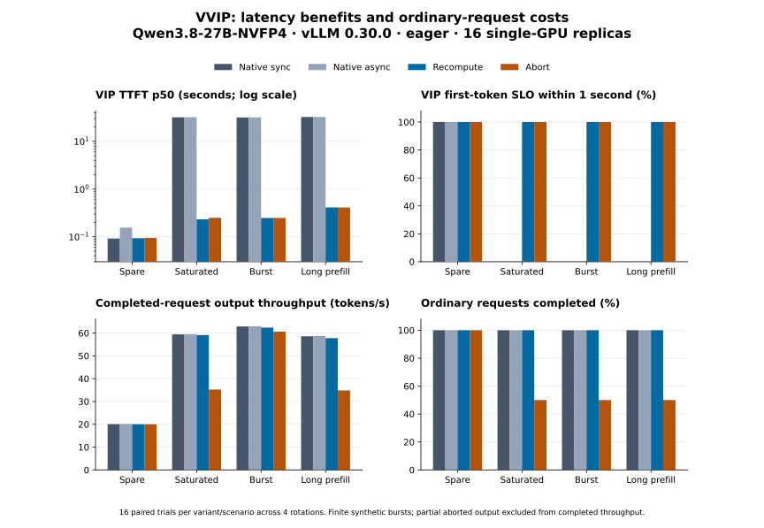

<p align="center">
  <picture>
    <source media="(prefers-reduced-motion: reduce)" srcset="assets/vvip-banner.png">
    
  </picture>
</p>

<h1 align="center">VVIP</h1>
<p align="center"><strong>Give urgent requests the next turn.</strong><br>A portable agent skill for running-request preemption on self-hosted vLLM.</p>

<p align="center">
  <a href="LICENSE"></a>
  
  
  
</p>
<p align="center">
  <a href="#install">Install</a> · <a href="skills/vvip/references/operation.md">Quick start</a> · <a href="skills/vvip/references/design.md">How it works</a> · <a href="docs/EXPERIMENTS.md">Benchmarks</a> · <a href="assets/vvip-banner.png">Static banner</a>
</p>

A VIP request arrives while ordinary requests occupy every running slot. Native priority ordering alone can leave it waiting. VVIP lets the engine preempt an eligible lower-priority request at a safe iteration boundary.

The skill gives Codex and other agents the instructions, checks, and scripts to operate that mechanism. The actual scheduler extension runs inside **your vLLM server**. It cannot change a hosted provider's scheduling or an agent's own hosted inference.

## Two actions. One scheduler.

| Action | What happens to ordinary work | Use when |
| --- | --- | --- |
| **Recompute & resume** | Release GPU state references, retain token history, and continue the original stream after replay | Ordinary requests must still finish |
| **Abort** | End permanently with `abort / vvip_preempted`; never silently retry | Ordinary work may be discarded |

No extra gateway, remote controller, or duplicate resource ledger. VVIP reuses vLLM's native queues, request objects, and cache managers.

<p align="center"></p>

## Install

### With a skill manager

Install the complete skill with the open [Skills CLI](https://github.com/vercel-labs/skills):

```sh
npx skills add matthewxj/vvip_skill --skill vvip
```

Select your agent and installation scope when prompted. To target Codex explicitly:

```sh
npx skills add matthewxj/vvip_skill --skill vvip --agent codex
```

The repository must be accessible to your Git credentials while it is private. Installation copies agent instructions and Python helpers; it does **not** install vLLM, download weights, or start a GPU service.

### Without Node.js

[Download the repository ZIP](https://github.com/matthewxj/vvip_skill/archive/refs/heads/main.zip), or clone it:

```sh
git clone https://github.com/matthewxj/vvip_skill.git
cd vvip_skill
```

Copy the entire `skills/vvip` directory into your agent's skill directory. Keep `scripts`, `references`, `agents`, `assets`, and `LICENSE` together. For agents without skill discovery, explicitly ask them to read `skills/vvip/SKILL.md`.

To install a repository-local Codex skill from a clone, the included `.agents/skills/vvip` discovery link already points to the canonical directory. Start a new session in the repository.

### Ask your agent

> Use vvip to inspect my self-hosted vLLM deployment. Produce a shadow-mode plan, verify recompute and abort on an isolated instance, and compare VIP latency with ordinary-request completion and throughput.

## First run

Python 3.10+ is enough to inspect the skill and print a plan. In the repository root:

```sh
python3 skills/vvip/scripts/vvip.py serve /models/YOUR_MODEL \
  --mode shadow --action recompute -- \
  --served-model-name my-model --port 8000
```

This prints a plan. **Only `--execute`, placed before `--`, starts the service.** On the actual GPU host, check the installed engine first:

```sh
python3 skills/vvip/scripts/vvip.py doctor
```

Follow the [complete quick start](skills/vvip/references/operation.md) for pinned weights, Docker, both actions, negative controls, API examples, and rollback. Model-specific options still matter. The optional Python CLI can be installed with `python -m pip install .`; its default installation has no inference dependencies.

## Measured results

**Qwen3.8-27B-NVFP4 · vLLM 0.30.0 · 16 RTX 6000D cards · 1,664 measured requests.**

Four variants—native synchronous priority, native asynchronous priority, recompute, and abort—rotate across all 16 cards. There are 16 matched trials per variant and workload, with no invalid reports.

| Contended workload | VIP first-token p50: native → recompute | Reduction | Completed-request throughput change |
| --- | --- | ---: | ---: |
| Saturated | 31.905 s → **0.233 s** | **99.27%** | −0.54% |
| Burst | 31.706 s → **0.248 s** | **99.22%** | −0.78% |
| Long prefill | 32.452 s → **0.414 s** | **98.72%** | −1.41% |

In these contended samples, the one-second VIP first-token target improved from **0% to 100%**. All **272 ordinary requests** in the recompute arm completed. Some ordinary answers arrived later, and replay consumed additional work. Abort achieved similar VIP latency but only **50% ordinary completion** in the contended workloads. The spare-capacity control showed no added benefit.

<p align="center"></p>

These are finite synthetic bursts with eager execution and a concurrency limit of four—not production SLA or peak-capacity claims. Concurrent output is **not guaranteed to be token-identical**: 223/416 recompute outputs matched the synchronous baseline. Same-process repetitions with preemption disabled also differed; answer-quality equivalence has not been established.

[Full protocol, intervals, costs, and diagnostics](docs/EXPERIMENTS.md) · [Machine-readable evidence](docs/evidence/qwen38/performance-manifest.json)

## Compatibility

The adapter follows engine state contracts rather than a model-name allowlist.

- **Pinned engine:** vLLM `0.30.0`, with SHA256 checks on 35 implementation files.
- **Candidate models:** autoregressive attention decoders; native GDN + attention hybrids with prefix caching disabled and `mamba_cache_mode=none`.
- **Execution:** synchronous, one batch in flight; local state ownership. TP changes require their own GPU acceptance.
- **Rejected configurations:** external KV/EC connectors, P/D, unsupported hybrid state, LoRA, speculative decoding, pooling, diffusion, and encoder-decoder paths.

The 27B model has direct evidence for both actions, off/shadow controls, long-history replay, and repeated workloads. Historical abort records for other model families are labeled separately. **Broad applicability is not a claim that every mainstream model has been certified.** See the [compatibility matrix](skills/vvip/references/compatibility.md).

## Operating rules

Lower `priority` is more urgent: ordinary `0`, VIP `-10` is one convention. Equal-priority requests never preempt one another. Use `off` to disable VVIP, `shadow` to inspect decisions, and `enforce` to apply the selected action.

Defaults include a 100 ms wait threshold, 200 ms decision interval, 60 decisions/minute, two interruptions/request, and protection after 30 seconds. A configured `VVIP_DISABLE_FILE` stops new decisions without restarting. Shared ingress must authorize both JSON `priority` and `X-Vllm-Priority`; client-supplied urgency is not authorization.

## Documentation and development

| Resource | Contents |
| --- | --- |
| [Quick start](skills/vvip/references/operation.md) | Install, serve, validate, operate, roll back |
| [Design](skills/vvip/references/design.md) | Native state ownership, replay equations, abort delivery, invariants |
| [Compatibility](skills/vvip/references/compatibility.md) | Executable gates and model-specific evidence |
| [GPU validation](skills/vvip/references/validation.md) | Exact model/runtime identity and correctness results |
| [Experiments](docs/EXPERIMENTS.md) | Workloads, statistical method, full results, limitations |
| [Contributing](CONTRIBUTING.md) | Tests, packaging, and regenerating figures |

`skills/vvip` is the installable unit. `docs` contains the reproducible evidence. `tests` checks policy and client behavior without requiring a GPU. Raw environment snapshots, credentials, model weights, and local artifacts stay out of Git.

## License

[MIT](LICENSE). Model weights, vLLM, and other dependencies retain their own licenses.
