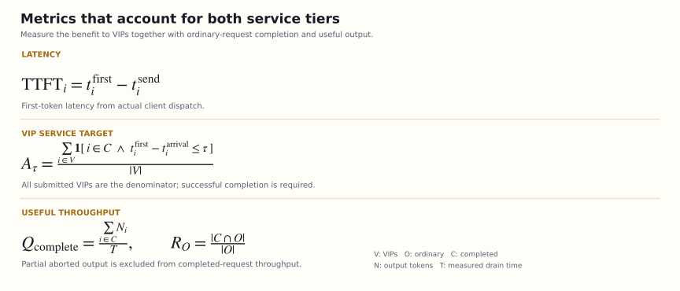

# Technical validation and VIP latency study

**Model:** [nvidia/Qwen3.8-27B-NVFP4](https://huggingface.co/nvidia/Qwen3.8-27B-NVFP4), revision `482ca0f3832238542f8f5295dde86b5f22711d80`.

The correctness suite, four modes, runtime controls, and 2,288-position mid-generation replay passed. The formal matrix completed **256 valid reports and 1,664 measured requests** across four GPU rotations. A separate same-process reproducibility diagnostic completed afterward. This report retains the protocol, numerical differences, costs, and limits alongside the results.

[GPU identity and correctness](../skills/vvip/references/validation.md) · [Full statistics](evidence/qwen38/performance-summary.json) · [Request/event dataset](evidence/qwen38/benchmark-reports.jsonl.gz)

## 1. Claims and required evidence

| Claim | Required observation | Insufficient substitute |
| --- | --- | --- |
| Running work is actually preempted | Executed victim, exact ID, native release event, VIP execution | Reordering waiting requests or closing HTTP |
| Recompute preserves request continuity | Same-ID/boot resume, no duplicated output, fixed-sample token comparison, successful reuse | Submitting a replacement request with similar text |
| Abort reaches the client | Exactly one abort/vvip_preempted terminal and release | Deleting an internal object or timing out |
| Hybrid state is reconstructed | All attention/GDN state groups released, replay from zero, real quantized-model acceptance | Model loading alone |
| VIPs benefit | Matched workloads, repeated TTFT/E2E/SLO measurements, retained failures | A single best latency sample |
| Costs are visible | Ordinary completion, E2E/pauses, useful throughput, replay counts | Reporting drain time after discarding ordinary work |

## 2. Historical evidence

Original records were checked for successful requester HTTP responses, preempted victims, worker terminal state, scheduler/KV release, stage identifiers, and nonempty internal IDs. Public records include sanitized checks and source SHA256:

| Model | Topology | Cross-tier abort cases | Scope |
| --- | --- | ---: | --- |
| Kimi K3 | Single engine | 6/6 | Historical abort implementation |
| Qwen3.8 NVFP4 | Single engine | 6/6 | Historical abort implementation |
| GLM-5.3 NVFP4 | P/D | 6/6 | Historical two-stage release |
| GLM-5.3 NVFP4 | Single engine | 6/6 | Historical abort implementation |

[Sanitized historical evidence](evidence/historical-abort-summary.json). These records do not validate this adapter's code or recompute path. Some source records also describe later lifecycle issues, so bounded success is not a claim of indefinite stability. DeepSeek-v4.1-flash and MiniMax-M3 are not included in the historical success set. Current P/D remains unsupported.

## 3. Model and hardware identity

The model configuration is `Qwen3_5ForConditionalGeneration`: 64 layers, comprising 48 linear-attention/GDN and 16 full-attention layers. The checkpoint mixes NVFP4 and FP8. The public model label and implementation-class name differ.

The experiment first established native loading on fixed vLLM 0.30.0; no silent model/runtime substitution followed. [Validation](../skills/vvip/references/validation.md) records the exact image, runtime, driver, kernel, and weight identity. All 19 model files were checked against official LFS SHA256 or Git blob SHA1, then listed in a full SHA256 manifest and independently verified again. Public downloads used no credentials.

Hardware was one host with 16 RTX 6000D cards, each reporting 85,651 MiB, driver 580.178.04. Each inference replica used **one card**. This is neither a TP16 experiment nor 16 independent hosts.

## 4. Correctness before performance

First came native health and generation. Independent single-sequence services then ran recompute, abort, off, and shadow, preserving model, quantization, cache, hardware, and requested lengths. GDN used no prefix caching and `mamba_cache_mode=none`; execution was eager.

Each smoke ran a 512-token baseline, ordinary output, a 16-token VIP after ordinary output began, and an 8-token reuse probe. The client required exactly one terminal, `[DONE]`, exact token count for length completion, and correlated native internal IDs/boot/runtime. Failed or divergent data was not discarded.

The additional [synthetic inventory prompt](evidence/replay-stress-prompt.txt) contained 2,160 input tokens. The VIP arrived after at least 128 output tokens; actual preemption occurred after 129, with 2,288 computed positions. Replay was 1,024 + 1,024 + 240 positions, and all 512 output IDs matched baseline.

Equal/reverse priorities, the live disable file, and client-disconnect reuse passed. Single-sequence acceptance does not certify CUDA graphs, every cancellation race, long-running operation, or all batch shapes.

## 5. Formal comparison design

The primary baseline is native **priority + synchronous execution**, compared with otherwise matching recompute and abort. A separate native async arm measures the opportunity cost of synchronous execution. They are never pooled as one baseline.

Before any formal measurement, the design was frozen as four groups of four cards, four rounds, and four variants. For each group, variant index is `(within-group GPU index + round) mod 4`; block is `round × 4 + group index`. Each block/scenario has one measured trial per variant, yielding **16 matched trials per scenario/variant**. Every variant visits every physical card.

This pre-measurement amendment replaced an initial four-card × four-round × four-trial plan while retaining the same trial totals. CPU affinity assigns each replica 12 physical cores and their SMT siblings on its GPU's NUMA node, with no overlap. Startup, full-workload warmup, and downloads are excluded. Trials fully drain before the next trial.

Shared settings:

| Setting | Value |
| --- | --- |
| Context / sequence limit / token budget | 8,192 / 4 / 1,024 |
| GPU-memory fraction | 0.60 |
| Execution / input | Eager / text only |
| Cache | Prefix off; mamba cache none |
| Parallelism | TP=DP=PP=1 |
| VVIP wait / interval | 100 ms / 200 ms |
| VVIP limits | 60 decisions/minute; two interruptions/request; protected after 30 s |
| Sampling | seed 42; temperature 0; ignore_eos=true; fixed requested output length |
| Transport | In-container loopback, no external container network |

The zero wait threshold used by correctness smokes was **not** carried into performance measurements.

### Workloads

`benchmark.py` defines fixed arrivals and synthetic prompts. Ordinary jobs arrive at t=0. A deterministic block/job nonce differentiates prompts across trials; matching variants receive identical prompts.

| Scenario | Ordinary work | VIP work | VIP arrival offsets |
| --- | --- | --- | --- |
| Spare | 1 × 256 output tokens | 1 × 64 | 0.5 s |
| Saturated | 4 × 512 | 2 × 64 | 0.5, 0.75 s |
| Burst | 8 × 512 | 4 × 64 | 0.5, 0.75, 1.0, 1.25 s |
| Long prefill | 4 × 512; 96 additional input sentences | 2 × 64 | 0.5, 0.75 s |

VIP arrivals are scheduled in advance rather than delayed until a victim emits its first token. Each variant has 144 VIP and 272 ordinary requests: 416 total. All four variants total 1,664 measured requests. Warmups are excluded.

This is a study of **repeated finite bursts**, not sustained open-loop capacity. The standard-library HTTP/SSE client records dispatch lag, TTFT, finish time, token count/hash, and finish/stop reasons. Dispatch lag above 100 ms invalidates a report. Sampling settings control workload length; they are not production sampling recommendations.

Complete successful output hashes are compared with the synchronous baseline by block/trial/request index, including the native async arm. Fixed work and successful terminals do not imply numerical identity across batches.

## 6. Metrics and uncertainty



- **TTFT:** actual client dispatch to first output chunk containing tokens; scheduled-arrival TTFT is retained separately.
- **E2E:** dispatch to the complete terminal. Completion-time distributions describe successful requests; submission, abort, and error counts accompany them.
- **TPOT:** `(end − first token) / (output tokens − 1)`, including pauses. It is not kernel speed.
- **Maximum chunk gap:** visible streaming pause. SSE may combine tokens, so this is not exact per-token ITL.
- **VIP SLO:** scheduled arrival to first token at most one second **and eventual normal completion**, divided by all submitted VIPs. One second is an experimental target, not a commercial SLA.
- **Output throughput:** all emitted tokens, including partial/failed output, divided by measured drain time.
- **Completed-request throughput:** tokens from fully successful requests divided by the same time.
- **Replay:** the sum of post-model-step `recomputed.tokens`; token positions, not FLOPs or energy.
- **Abort waste:** already emitted tokens from aborted requests and aborted-request count, not all wasted GPU work.

Quantiles use nearest rank. A small-sample p99 may simply be the maximum. Paired comparisons use each block/trial's VIP TTFT p50; bootstrap resampling uses 2,000 draws and seed 42. The reported interval is for mean paired baseline-minus-treatment differences.

Blocks share a host and reuse cards across rounds. These intervals describe uncertainty within this design, not independent-datacenter population confidence. Concurrency four intentionally creates comparable contention; it is not an optimized capacity setting. VIPs arrive early, before 30-second age protection. The study does not promise late-arrival SLA, peak throughput, or a reduction in required GPU count.

## 7. Reproduce a workload

From the skill directory, after starting an isolated, matching server:

```sh
python3 scripts/benchmark.py --model qwen38-vvip --variant recompute \
  --scenario saturated --trials 8 --block 0 \
  --server-log artifacts/server.log --out artifacts/recompute-saturated-b0.json
```

Use the same trial/block/SLO for other variants. Reports cannot overwrite existing files. Native baselines also require logs. Aggregate only complete matching reports:

```sh
python3 scripts/analyze_benchmark.py artifacts/bench-*.json --out artifacts/summary.json
```

The analyzer rejects duplicate blocks, missing variant blocks, mismatched workload hashes/model aliases, and differing SLOs. Also compare actual arguments and weight hashes; an alias alone is not identity.

## 8. Meaning for VIP customers

Supported benefits are shorter first-response waiting, earlier completion of the fixed-length answer, and more requests meeting the specified first-response target while ordinary work occupies running slots. For an application with serial calls, multiplying a measured wait reduction by call count is only a conditional estimate—not a measured production workflow benefit.

The results do not demonstrate revenue, retention, answer quality, increased model capacity, or lower total cost. Recompute spends work to change service order; abort sacrifices ordinary completion. Policy choice depends on whether ordinary work may be abandoned and on the actual arrival distribution. Without contention, the same benefit should not be expected.

## 9. Evidence integrity

Results include revision, runtime/script hashes, image identity, non-sensitive arguments, all valid/invalid sample counts, per-variant metrics, and ordinary-request costs. Historical distributed success does not certify this local scheduler for P/D. Loading a model does not prove its preemption path.

The formal performance suite's **1,286 raw files** passed transfer checks. An independent validator regenerated every workload, checked per-request parameters, unique complete terminals, dispatch lag, actual requester/victim IDs, boot/runtime, CPU/GPU assignment, and final container state.

All **256 actual preemptions** correlate: 128 recompute and 128 abort. Every recompute victim resumed; replay totaled **40,957 positions**, exactly the sum of preemption computed-position watermarks. Every abort matched client terminal delivery. All 64 containers exited normally. There were **zero invalid reports, missing terminals, or request errors**. Explicit aborts are retained as non-completions.

- [Compressed request and event records](evidence/qwen38/benchmark-reports.jsonl.gz)
- [Conditions, hashes, and verification manifest](evidence/qwen38/performance-manifest.json)
- [Complete statistics](evidence/qwen38/performance-summary.json)
- [All variant/scenario summary rows](evidence/qwen38/performance-summary.md)

## 10. Performance results


### Recompute: VIP benefit

The table uses native synchronous priority as baseline. Each variant has 32, 64, and 32 VIP samples in saturated, burst, and long-prefill workloads respectively.

| Scenario | VIP TTFT p50: native → recompute | Reduction | Recompute p95 / p99 | One-second SLO: native → recompute | VIP E2E p50: native → recompute |
| --- | --- | ---: | --- | --- | --- |
| Saturated | 31.905 → 0.233 s | 99.27% | 0.269 / 0.271 s | 0% → 100% | 35.900 → 4.258 s |
| Burst | 31.706 → 0.248 s | 99.22% | 0.268 / 0.272 s | 0% → 100% | 35.724 → 4.283 s |
| Long prefill | 32.452 → 0.414 s | 98.72% | 0.444 / 0.450 s | 0% → 100% | 36.453 → 4.507 s |

Under these workloads, first-response waiting falls by about 31–32 seconds. The 64-token answer also finishes in about 4.3–4.5 seconds instead of roughly 36 seconds. Native async still waits around 32 seconds under contention, with throughput close to native sync; the benefit is not explained by selecting an obviously slow synchronous control.

Mean paired trial-p50 reductions, with bootstrap 95% intervals in seconds:

| Scenario | Recompute reduction [interval] | Abort reduction [interval] |
| --- | --- | --- |
| Saturated | 31.635 [31.510, 31.761] | 31.625 [31.501, 31.750] |
| Burst | 31.397 [31.280, 31.522] | 31.394 [31.276, 31.523] |
| Long prefill | 31.974 [31.842, 32.114] | 31.975 [31.844, 32.114] |

### Ordinary-request and throughput costs

All **272 ordinary requests in the recompute arm completed**. Some paused users waited longer, and replay added computation.

| Scenario | Ordinary E2E p50: native → recompute | Ordinary E2E p95: native → recompute | Completed-request tokens/s: native → recompute | Change |
| --- | --- | --- | --- | ---: |
| Saturated | 32.493 → 33.094 s | 32.946 → 37.175 s | 59.44 → 59.12 | −0.54% |
| Burst | 33.115 → 37.687 s | 70.066 → 70.138 s | 62.91 → 62.42 | −0.78% |
| Long prefill | 32.919 → 33.543 s | 33.536 → 37.962 s | 58.60 → 57.78 | −1.41% |

Burst ordinary median completion increases by about 4.6 seconds, while the tail changes little. Native scheduling already serves VIPs between ordinary waves, so summing individual pauses does not predict the entire population's tail.

Abort reaches similar VIP p50 first-response times, about 0.25–0.41 seconds, but ordinary completion is only **50% in each contended scenario**. It terminates 128 ordinary requests with **1,396 partial output tokens**. Completed-request throughput falls by **40.72%, 3.61%, and 40.54%** in saturated, burst, and long prefill. Surviving-request latency cannot represent aborted requests, and earlier drain is not higher useful throughput.

When ordinary work must complete, recompute offers the more suitable completion/latency tradeoff in these conditions. Abort is appropriate only when discarding that work is already acceptable.

### Spare-capacity control

No variant performs actual VVIP preemption; all requests complete. Native sync and recompute VIP p50 are **92.1 ms and 93.3 ms**. The paired mean-difference interval crosses zero, so no added benefit is established. Native async p50 is about 156 ms in this eager configuration; this is not a general claim about asynchronous backends.

## 11. Concurrent token identity

Complete successful outputs were compared by matching request index against native sync. Aborted requests are excluded from equal-length token comparisons.

| Scenario | Native async identical / compared | Recompute identical / compared | Successful abort-arm outputs identical / compared |
| --- | ---: | ---: | ---: |
| Spare | 30/32 | 26/32 | 30/32 |
| Saturated | 72/96 | 49/96 | 33/64 |
| Burst | 127/192 | 88/192 | 55/128 |
| Long prefill | 61/96 | 60/96 | 44/64 |

Overall recompute identity is **223/416**, versus **290/416** for native async. Spare differs despite no preemption. Single-sequence exact-replay evidence therefore cannot promise unchanged concurrent outputs. No real-task answer-quality equivalence evaluation was completed. The performance comparison controls inputs, output lengths, and arrivals—not identical semantic answers.

The pinned [reproducibility guide](https://github.com/vllm-project/vllm/blob/v0.30.0/docs/usage/reproducibility.md) does not guarantee default online reproducibility. [Batch invariance](https://github.com/vllm-project/vllm/blob/v0.30.0/docs/features/batch_invariance.md) is a separate beta capability with performance costs; it was not enabled. Its tested-model list does not automatically certify this quantized hybrid checkpoint.

## 12. Additional same-process diagnostic

This diagnostic was added after observing differences in the first completed rounds. It did not alter the formal parameters or remove matrix results. One GPU and one unchanged server process ran the same saturated workload with a full warmup, then:

```text
off → off → recompute → off → recompute → recompute
```

The configured disable file switched behavior without restarting or changing kernels. Each wave has four ordinary and two VIP requests. `request_contract_passed` checks terminal/count and switch/preemption behavior; it does **not** require token identity.

All 36 measured requests completed with unique terminals. Each recompute wave had two preemptions, all resumed. Total replay was **489 positions**, equal to the saved watermarks. Off waves had no preemption. Fourteen raw files passed transfer checks: [full report](evidence/qwen38/determinism.json), [conditions and hashes](evidence/qwen38/determinism-summary.json).

Compared with the first off wave:

| Wave | Mode | All identical / total | Ordinary identical / total | VIP identical / total | Preemptions |
| --- | --- | ---: | ---: | ---: | ---: |
| 1 | Off, before any VVIP preemption | 4/6 | 2/4 | 2/2 | 0 |
| 2 | Recompute | 4/6 | 4/4 | 0/2 | 2 |
| 3 | Off | 4/6 | 2/4 | 2/2 | 0 |
| 4 | Recompute | 4/6 | 4/4 | 0/2 | 2 |
| 5 | Recompute | 2/6 | 2/4 | 0/2 | 2 |

The first off/off repetition differed for two ordinary requests beginning at zero-based output positions 0 and 3, before any actual preemption. Thus not every difference requires VVIP preemption, and differences are not explained solely by different GPUs/processes. This does not identify the unique numerical cause or exclude an additional recompute effect: both VIP outputs differ in each recompute wave.

Six waves of one synthetic workload cannot establish statistical answer-quality equivalence. Applications requiring strict reproducibility must separately validate suitable deterministic backends, sampling, and real task quality, then measure the associated performance cost. No original samples were removed and no backend was changed after the fact to erase these differences.

## 13. Independent recalculation and retention

From the repository root:

```sh
python3 skills/vvip/scripts/analyze_benchmark.py \
  docs/evidence/qwen38/benchmark-reports.jsonl.gz \
  --out artifacts/reproduced-summary.json
```

The dataset retains each original report's SHA256; the manifest retains condition, server-log, and final-container hashes. Local recalculation exactly matched the independently produced remote statistics. Compressed-input support was added to the analyzer without changing statistical arithmetic or the frozen measurement/runtime code.

The [plot generator](evidence/plot_performance.py) takes the statistics JSON. Matplotlib is report tooling, not an inference dependency:

```sh
python3 docs/evidence/plot_performance.py docs/evidence/qwen38/performance-summary.json \
  --out artifacts/performance.svg
```

The 27B correctness, long-history, performance, and diagnostic suites total **1,449 verified raw files**. Public files retain model identity, synthetic IDs, counts/hashes, events, and original-evidence hashes. Full server/container snapshots are not distributed. All test services exited and released GPU resources; this does not replace a long-running online leak test.
