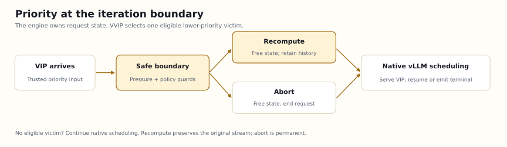
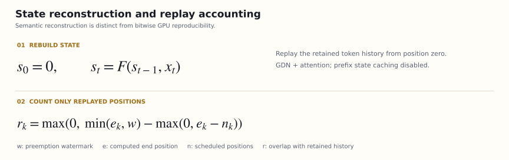

# Design and correctness argument

This document covers the request path, victim selection, state reconstruction, native resource ownership, terminal delivery, and limits of the evidence. The implementation is pinned to **vLLM 0.30.0**. It extends the scheduler without copying it or patching installed vLLM files.

## 1. Where preemption happens

Native priority orders waiting requests, but an urgent request can still wait behind long requests occupying every running slot. VVIP makes a bounded decision immediately before `Scheduler.schedule()`, then returns allocation to the native scheduler. Native memory-pressure preemption remains independent.



The skill instructs an agent; the Python extension inside EngineCore performs the action. The boundary is between completed inference iterations. It does not interrupt a CUDA kernel or provide a hard real-time deadline. An API key to a hosted model does not provide control over that boundary.

## 2. One owner of engine state

Each request has an engine ID, priority, status, computed position, generated-token history, and per-cache-group block mappings. VVIP reads those objects directly:

- `waiting` / `skipped_waiting`: native priority queues and blocked-state handling.
- `running`: requests already admitted to execution.
- `num_computed_tokens`: the position reached by model computation.
- `num_in_flight_tokens`: work that must finish before a victim is eligible.
- KV coordinator managers: the owners of request-to-block references, including recurrent-state blocks.

There is no second capacity ledger and no inference from connection counts or GPU utilization. Events contain the actual internal request ID, boot ID, and runtime SHA256. Acceptance clients correlate completion IDs and native random suffixes; they do not guess cancellation targets.

## 3. Eligibility and victim selection

An action requires all of the following:

1. Enforce mode; shadow records the candidate without mutation, while off delegates directly.
2. No disable-file condition, global pause, or current prefill throttle; rate limits allow a decision.
3. The native queue head is ready and has waited beyond the threshold. Unready grammar work does not trigger preemption.
4. Running sequences fill the sequence limit, or running demand consumes the current token budget.
5. A strictly lower-priority running request exists, with no encoder input, streaming-input session, or in-flight tokens.
6. The victim is within its interruption limit and has not reached its protected age.

At most one additional victim is selected per iteration. KV pressure alone remains the native allocator's responsibility; estimated freed blocks are not a promise that a particular request will fit.

Lower numbers mean higher priority. The victim key prefers lower urgency, a smaller generated/max-token ratio, more computed tokens, later arrival, then ID. The progress ratio is a heuristic, not a prediction of answer length.

When slots are full, an eligible victim exists, and no other higher-priority request intervenes, VVIP replaces part of the wait for an ordinary request to finish with the configured threshold, the next completed iteration boundary, and scheduling overhead. The VIP still needs its own prefill. Age protection, rate limits, long kernels, and other urgent requests prevent a fixed millisecond upper bound.

## 4. Recompute and resume

1. Remove the victim from `running` at a boundary with no outstanding GPU work.
2. Invoke native `_preempt_request`: release state references, reset the computed cursor, preserve token history, and requeue the request.
3. Clear the previous-step runner membership marker so immediate same-step readmission receives the full history.
4. Let native scheduling admit higher-priority work first, then resume the victim with its original ID.
5. Replay the retained history. The output processor continues the original stream without resending previously delivered tokens.

This is recomputation, not CPU swapping or recovery across process failure. A crashed server still breaks the original connection; VVIP does not silently submit a replacement request.

### Attention decoders

For a fixed token history, KV is the result of the model's computation over that history. Recomputing reconstructs state needed for further decoding. Native reference counts decide when shared prefix blocks are physically reusable. Releasing a request's private references does not imply lower driver-level GPU memory or deletion of every shared prefix.

### Gated DeltaNet hybrids

GDN models also retain convolution and recurrent state. The adapter inspects actual cache groups: native **GDN_ATTN plus attention**, prefix caching disabled, `mamba_cache_mode=none`, and zero speculative blocks. It does not infer these properties from the model name.

The audited upstream path is:

- MambaManager removes the request's state-block mappings during release.
- Readmission starts from computed position zero, without a prefix-state checkpoint hit.
- GDNAttentionMetadata sets `has_initial_state` from computed context length.
- Position-zero convolution prefill starts with zero history; recurrent prefill resets the corresponding initial state.
- The retained token sequence rebuilds convolution and recurrent state.



In the recurrence, the same initial state and token sequence reconstruct state under identical operator semantics. Actual GPU prefill/decode kernels, quantization, and reduction order can differ. This is a semantic argument, not a proof of numerical identity. Unknown SSMs and shared hybrid checkpoints require separate adaptation.

Retaining history does not guarantee identical future tokens across batches. The pinned [upstream reproducibility guide](https://github.com/vllm-project/vllm/blob/v0.30.0/docs/usage/reproducibility.md) distinguishes seeded sampling from batch invariance. Our concurrent matrix includes differences in native async and no-preemption controls. Those differences neither prove state corruption nor exclude an additional effect from recompute. Single-sequence identity, terminal correctness, and concurrent token comparisons are separate claims.

## 5. Permanent abort

Native `finish_requests(..., FINISHED_ABORTED)` must return the selected victim and remove it from running, the request table, and every cache-group mapping. During `update_from_output`, VVIP emits one native output carrying the original internal ID:

```text
finish_reason = abort
stop_reason   = vvip_preempted
```

Freeing the scheduler object alone does not deliver a terminal response to an API consumer. The explicit output closes that gap; the `_aborted` queue is emptied after delivery. HTTP may still be 200. Clients must treat the existing text as partial output and inspect the finish/stop reasons.

## 6. Release invariants

Assumptions: audited source, synchronous execution, one in-flight batch, no external state transfer, and native managers owning the resources. Startup checks enforce these supported configurations.

- The prior model result is processed before the next decision; the victim has zero in-flight tokens.
- Native methods update queues and reference counts. VVIP does not edit GPU tensors or fabricate allocations.
- After the action, every manager must have removed the request's block mapping, the request must have left running, and no deferred-free operation may remain. Abort also requires its removal from the request table.
- A failed invariant raises an error rather than recording successful release.
- The native allocator decides whether the next request can fit.

Starting from valid native state, each VVIP change either does nothing or uses the same native transition and checks its postconditions. Under the assumptions, VVIP introduces no second allocation counter that could double-allocate resources. This is not a formal proof of all vLLM code, kernels, drivers, or hardware failure behavior.

## 7. Replay accounting and complexity

At preemption, save the computed position as watermark `w`. A later scheduled step covers `[end - scheduled, end)`. Count only its overlap with `[0, w)`, as shown in the equation above. Prefix-cache hits outside the scheduled interval and newly generated positions do not count. Emit `recomputed.tokens` only after the model step returns.

The metric counts re-executed token positions, not FLOPs, milliseconds, or energy. Costs vary by context, cache, and hardware. Abort's partial output count also does not measure all wasted GPU work.

Victim selection is linear in running requests; metadata cleanup is linear in live requests. Python does not copy KV tensors. Large-concurrency deployments still need to measure CPU overhead.

## 8. Protection and failure boundaries

- Rate limits, interruption caps, and protected age reduce disruption. Strict priority under unlimited VIP arrivals cannot guarantee finite ordinary-request waiting time; admission control remains external.
- A present or unreadable `VVIP_DISABLE_FILE` stops new decisions. It cannot restore an aborted request.
- Source and configuration gates also apply in off/shadow. There is no hash-bypass option.
- Logs are diagnostic records, not durable remote release receipts. Process crashes can lose the final event or response.
- Trusted ingress must validate both JSON `priority` and `X-Vllm-Priority`; upstream gives the header precedence.
- VVIP does not replace model quantization, templates, or tool parsers. Model capability and scheduling capability require separate validation.

## 9. Evidence and extension points

Evidence progresses from source checks and CPU behavior to target GPU correctness, individual model/topology coverage, and repeated matched workloads. Previous abort results do not certify this adapter's recompute path. See [compatibility](compatibility.md) and [GPU validation](validation.md).

Async/PP support would require GPU-write and deferred-free fences. Other hybrid states require reset/checkpoint review. Connectors and P/D require actual transfer IDs and both-stage ownership proofs. Add those only with a reviewed contract and target tests; removing a guard is not an implementation.

## Audited upstream entry points

- [Scheduler](https://github.com/vllm-project/vllm/blob/v0.30.0/vllm/v1/core/sched/scheduler.py)
- [EngineCore](https://github.com/vllm-project/vllm/blob/v0.30.0/vllm/v1/engine/core.py)
- [KV manager](https://github.com/vllm-project/vllm/blob/v0.30.0/vllm/v1/core/kv_cache_manager.py)
- [Per-type cache managers](https://github.com/vllm-project/vllm/blob/v0.30.0/vllm/v1/core/single_type_kv_cache_manager.py)
- [GDN metadata](https://github.com/vllm-project/vllm/blob/v0.30.0/vllm/v1/attention/backends/gdn_attn.py)
- [GDN computation and initial state](https://github.com/vllm-project/vllm/blob/v0.30.0/vllm/model_executor/layers/mamba/gdn/qwen_gdn_linear_attn.py)
- [Convolution state](https://github.com/vllm-project/vllm/blob/v0.30.0/vllm/model_executor/layers/mamba/ops/causal_conv1d.py)
